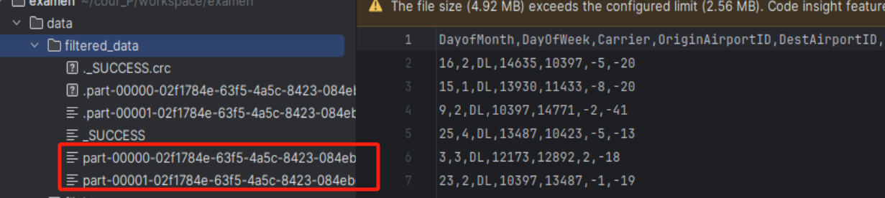
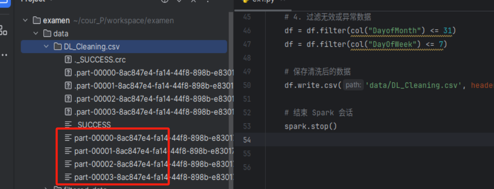
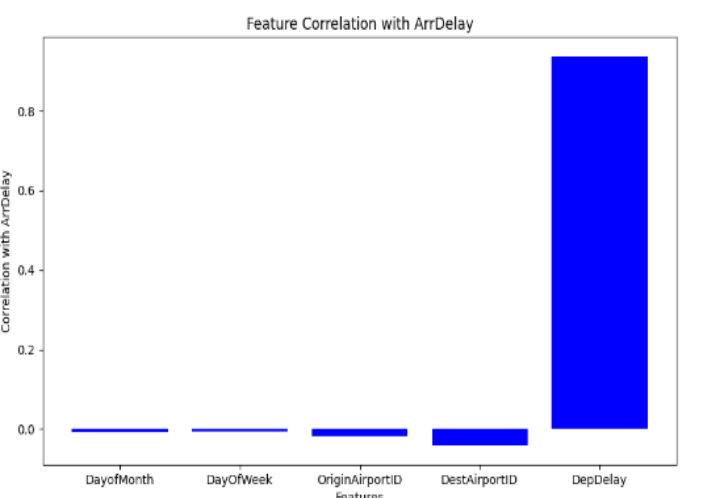
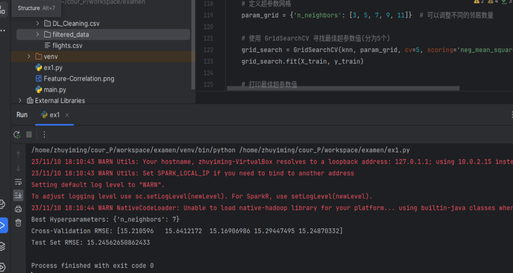
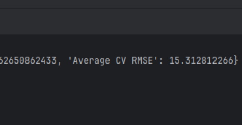
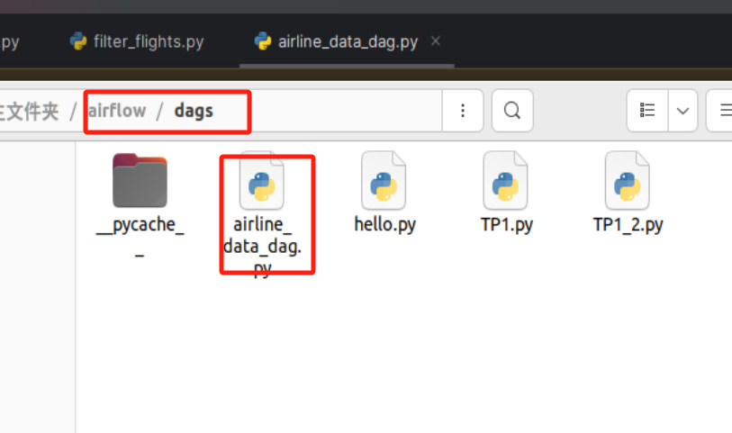

# Initial Plan for Spark ML
> project instruction:
>> Ex1 is my main machine learning main function.
>> Dags is my task scheduler.
>> Flight is the task function.


## Objectives

1. Goal: Collaborate with an airline company to analyze their data and develop a model to determine the likelihood of flight delays.

## Analysis of Tables

1. flight.csv

   > - **DayofMonth**: A specific day of the month, here it is the 19th.
   > - **DayOfWeek**: A specific day of the week, here it is Friday (5 indicates Friday).
   > - **Carrier**: The code for the airline, here it is DL, possibly representing Delta Airlines.
   > - **OriginAirportID**: A unique identifier for the departure airport, here it is 11433.
   > - **DestAirportID**: A unique identifier for the destination airport, here it is 13303.
   > - **DepDelay**: Departure delay (in minutes), here it is -3, indicating the flight departed 3 minutes early.
   > - **ArrDelay**: Arrival delay (in minutes), here it is 1, indicating the flight arrived 1 minute late.
   >
   > Collectively, these data points provide information about the date, airline, departure and destination airports, as well as the departure and arrival delays of a flight.

2. airport.csv

   > Basic information about airports, including the following columns:
   >
   > - **airport_id**: A unique identifier for the airport.
   > - **city**: The name of the city where the airport is located.
   > - **state**: The abbreviation for the state where the airport is located.
   > - **name**: The name of the airport.

## Data Cleaning

> - Handle missing values: Use Spark’s built-in features or write custom functions to deal with missing values.
> - Handle duplicates: Use methods like `dropDuplicates()` to remove duplicate rows.
> - Handle outliers: Implement specific outlier handling methods depending on your dataset.

## Data Analysis

The airport table is not very useful for building the model, so I plan to use the flights table to develop the model and predict "ArrDelay".

## Data Preparation

1. Feature Engineering

   > Conduct feature engineering to make the data suitable for training a machine learning model.
   >
   > I plan to use linear regression for analysis, examining the correlation between features and the outcome.

2. Intuition

   > All the information (features) should be very useful.

## Model Design

### Algorithms

1. KNN
2. Linear Regression

### Parameter Tuning

### Evaluate and Select the Model with the Highest Score

# Execution

> Based on the objective and the structure of the tables, I will choose an airline company to collaborate with.

## Selecting a Suitable Company

> DL Airlines is my choice for collaboration (the analysis process for other airlines would be the same, but due to limitations of my equipment, I will analyze only one company).

### Execution Results

Obtained a filtered dataset for the airline company DL. Part-00 and part-01 are the results of my two partition calculations.



## Data Cleaning

Eliminate non-compliant data.

1. Handle missing values.
2. Format fields.
3. Handle data types.
4. Remove duplicates.
5. Eliminate unreasonable data.

> Dates must be less than 31 and weekdays less than 7.

### Execution Results



## Feature Selection

### Intuition

Label: ArrDelay Features: DayofMonth, DayOfWeek, OriginAirportID, DestAirportID, DepDelay

### Analyzing Correlation with Mathematical Models

#### Results



From the image analysis, the label is most correlated with departure delay. There is also some relation with airports.

There is virtually no connection with the date. Therefore, I will choose departure airport, destination airport, and departure delay as my features, removing the month and weekday features from my initial intuition.

## Algorithms

> Since I have filtered the data to a very small scale, I will attempt more computationally intensive algorithms.

### KNN

> Upon reviewing the official Spark API documentation, I found no methods related to KNN. Therefore, I used SKlearn as a substitute.

#### Results



1. Best hyperparameter n = 7
2. CV RMSE = 15.210596, 15.6412172, 15.16906986, 15.29447495, 15.24870332
3. RMSE = 15.24562650862433

However, I choose the average CV as the final loss = 15.312812266



## Linear Regression

### Result Analysis


We can see that the effect is best when degree = 3. Additionally, to avoid overfitting, it's not advisable to choose too high a degree. Therefore, degree 3 is a balanced choice.

### Conclusion

Based on my objectives, I chose two ML algorithms and then compared the RMSE of both models. I believe that linear regression with degree = 3 yields the best result.

# Task Scheduling

I plan to divide the dataset according to the names of the companies, and then divide the tasks based on these different company datasets. One company represents one task.

Repeat my previous learning process. The start date is November 11th. The specific number of companies I set is not important as I am dividing tasks based on one company per task.

### Task Workflow

Step 1: Create script files to execute tasks.

Step 2: Create DAG files in dags for task scheduling.

## Results



Code details and comments are in my project.

------

# Complete Code Workflow

> (Supplementary documentation)

1. **Import Necessary Libraries**:
   - Import `SparkSession` for initializing Spark session.
   - Import `matplotlib.pyplot` and `numpy` for data visualization.
   - Since spark has relatively few algorithms, I need to import the ```SKlearn``` package to implement my idea.
2. **`sel_data` Function**:
   - Initialize the Spark session.
   - Read the CSV file.
   - Filter data for a specific airline (e.g., Delta Airlines).
   - Repartition the data for performance optimization.
   - Save the filtered data to a new file.
3. **`data_clean` Function**:
   - Initialize the Spark session.
   - Load data.
   - Data cleaning steps, including removing duplicate data, handling missing values, filtering invalid data, etc.
   - Save the cleaned data.
4. **`corr` Function**:
   - Initialize the Spark session.
   - Read data.
   - Calculate the correlation between specific features and "Arrival Delay".
   - Close the Spark session.
   - Prepare data for visualization.
5. **`knn` Function**:
   - Import necessary libraries.
   - Initialize the Spark session.
   - Read data.
   - Select features and the target variable.
   - Convert PySpark DataFrame to Pandas DataFrame.
   - Close the Spark session.
   - Split the dataset into training and testing sets.
   - Create a K-Nearest Neighbors regression model.
   - Define a hyperparameter grid.
   - Use GridSearchCV to find the best hyperparameters.
   - Print the best hyperparameters.
   - Use cross-validation to evaluate model performance.
   - Predict and evaluate the model on the test set.
6. **`rmse_knn` Function**:
   - Define results and metrics.
   - Calculate the average RMSE for cross-validation.
   - Print a dictionary containing model results.
7. **`LRegression` Function**:
   - Import necessary libraries.
   - Initialize the Spark session.
   - Read data.
   - Select features and the target variable.
   - Convert PySpark DataFrame to Pandas DataFrame.
   - Close the Spark session.
   - Specify the maximum degree of polynomial features to consider.
   - Initialize a list to store mean squared errors.
   - Split the dataset into training and testing sets.
   - Loop through different polynomial degrees.
   - Create polynomial features.
   - Create a Linear Regression model.
   - Use cross-validation to evaluate model performance.
   - Calculate RMSE for the test set.
   - Print degree, cross-validation score, and test RMSE.
   - Append the test RMSE to the list of losses.
   - Plot the RMSE vs. polynomial degree.
